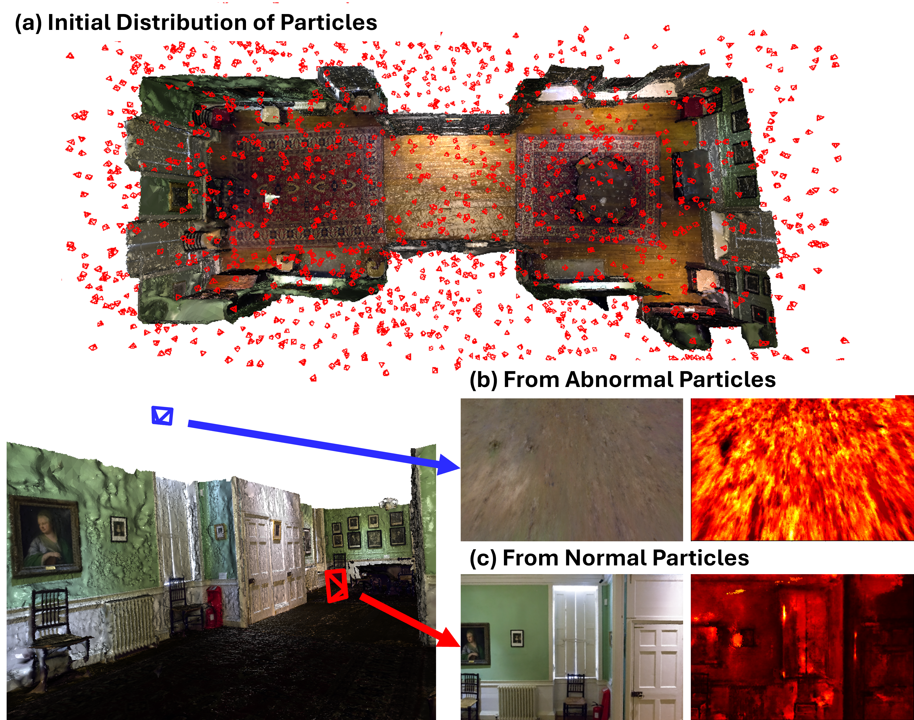
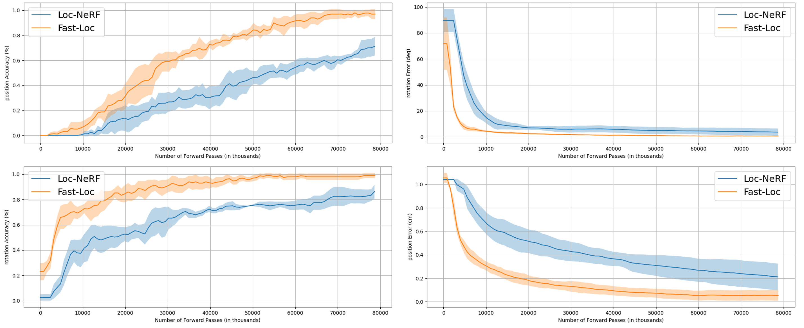

# Fast Global Localization on Neural Radiance Field (ICRA 2025)

[](https://arxiv.org/abs/2406.12202)


---

## 🔥 Overview  
Fast-Loc-NeRF is a novel approach for **fast and accurate global localization** in NeRF maps. While Loc-NeRF introduced the idea of Monte Carlo Localization (MCL) using NeRF, it suffers from **slow rendering speed**, making it impractical for real-time applications.  

**Fast-Loc-NeRF** improves upon this by introducing:  
✔ **Particle Rejection Weighting**: Uses NeRF's inherent uncertainty estimation to filter out unreliable particles.  
✔ **Coarse-to-Fine Matching**: Matches rendered pixels with observed images progressively from low to high resolution, reducing computational overhead.  

---

## 🏞️ Overview Diagram  

<p align="left">
  
  
</p>
*Figure: Overview of Fast-Loc-NeRF.*

---

## 📊 Experimental Results  

Fast-Loc-NeRF outperforms existing methods in both **accuracy and efficiency**.  

  
*Figure: Localization accuracy and speed comparison.*

---

## 📽️ Video Demonstration  

[](https://youtu.be/hkKbtk9wHGk)  
*(Click the image to watch the video on YouTube)*

---

## Using LLFF Data for Global Localization

Download LLFF images and pretrained NeRF-Pytorch weights from [NeRF-Pytorch](https://github.com/yenchenlin/nerf-pytorch). 

Place data using the following structure:

```
├── configs   
│   ├── ...
├── ckpts                                                                                                       
│   │   ├── fern
|   |   |   └── fern.tar                                                                                                                     
│   │   ├── fortress
|   |   |   └── fortress.tar                                                                                   
│   │   ├── horns
|   |   |   └── horns.tar   
│   │   ├── room
|   |   |   └── room.tar   
│   │   └── ...                                                                                 
                                                                                            
├── data                                                                                                                                                                                                       
│   ├── nerf_llff_data                                                                                                  
│   │   └── fern  # downloaded llff dataset                                                                                                                         
│   │   └── fortress  # downloaded llff dataset                                                                                  
│   │   └── horns   # downloaded llff dataset
|   |   └── room   # downloaded llff dataset
|   |   └── ...
```

After updating your yaml file `fast.yaml` with the directory where you placed the data and any other params you want to change, you are ready to run Fast-Loc-NeRF! By default, Fast-Loc-NeRF will estimate the camera pose of 5 random images from each of fern, fortress, horns, room (20 images in total). You can use rviz to provide real-time visualization of the ground truth pose and the particles.

---

# 1. Installation

## System Requirements

* **ROS Environment**: Install ROS following the [official ROS installation guide](http://wiki.ros.org/ROS/Installation).
* **GPU Support**: CUDA-compatible GPU recommended for optimal NeRF rendering performance in global localization experiments.
* **Docker Support**: The system is designed to run in containerized environments using Docker for consistent deployment.

## Setup Fast-Loc-NeRF

### Option 1: Docker Setup (Recommended)

Fast-Loc-NeRF can be easily deployed using Docker containers, which provides a consistent environment across different systems:

```bash
# Clone the repository
git clone https://github.com/kmk97/Fast-Loc-NeRF.git
cd Fast-Loc-NeRF

# Build and run Docker container (detailed Docker setup will be provided)
# Docker configuration handles all dependencies and ROS environment setup automatically
```

### Option 2: Local Installation

```bash
# Create workspace for Fast-Loc-NeRF
mkdir -p ~/fast_locnerf_ws/src
cd ~/fast_locnerf_ws/
catkin init

# Clone Fast-Loc-NeRF repository
cd ~/fast_locnerf_ws/src
git clone https://github.com/kmk97/Fast-Loc-NeRF.git

# Build the workspace
catkin build

# Activate the workspace
source ~/fast_locnerf_ws/devel/setup.bash

# Install required Python packages for Fast-Loc-NeRF
cd ~/fast_locnerf_ws/src/Fast-Loc-NeRF
pip install torch torchvision torchaudio
pip install opencv-python numpy scipy matplotlib pyyaml tqdm imageio configargparse
```

---

# 2. Running Fast-Loc-NeRF

## Docker Execution (Recommended)

For Docker users, Fast-Loc-NeRF can be launched directly within the containerized environment:
```bash
# Run Fast-Loc-NeRF in Docker container
# (Detailed Docker run commands will be provided)
```

## Local Execution

For local installation, launch Fast-Loc-NeRF using ROS:
```bash
roslaunch locnerf navigate.launch parameter_file:=<config_file.yaml>
```

**Note**: Both Docker and local execution support RViz visualization for monitoring global localization progress and particle distributions.

# 3. Configuration Files

Fast-Loc-NeRF provides two configuration profiles in the `/cfg` directory for different experimental scenarios. These configurations work seamlessly in both Docker and local environments:

- **`fast.yaml`**: Our enhanced configuration featuring particle rejection weighting and coarse-to-fine matching algorithms. This profile showcases Fast-Loc-NeRF's accelerated convergence and improved accuracy in challenging global localization tasks.


---


## Publications

If you find this code relevant for your work, please consider citing our paper:

```bibtex
@article{kong2024fast,
  title={Fast global localization on neural radiance field},
  author={Kong, Mangyu and Lee, Seongwon and Lee, Jaewon and Kim, Euntai},
  journal={arXiv preprint arXiv:2406.12202},
  year={2024}
}
```

---

# Acknowledgments

This work is built upon [Loc-NeRF](https://github.com/MIT-SPARK/Loc-NeRF) and [NeRF-Pytorch](https://github.com/yenchenlin/nerf-pytorch).

---

## License

This project is licensed under the MIT License - see the [LICENSE](LICENSE) file for details.

