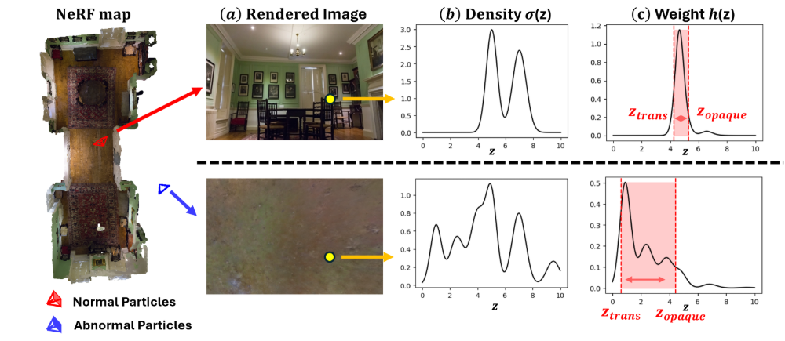

# Fast-Loc-NeRF: Fast and Accurate Global Localization in NeRF Maps  
 *Accepted to ICRA 2025*  

---

## 🔥 Overview  
Fast-Loc-NeRF is a novel approach for **fast and accurate global localization** in NeRF maps. While Loc-NeRF introduced the idea of Monte Carlo Localization (MCL) using NeRF, it suffers from **slow rendering speed**, making it impractical for real-time applications.  

**Fast-Loc-NeRF** improves upon this by introducing:  
✔ **Particle Rejection Weighting**: Uses NeRF’s inherent uncertainty estimation to filter out unreliable particles.  
✔ **Coarse-to-Fine Matching**: Matches rendered pixels with observed images progressively from low to high resolution, reducing computational overhead.  

These enhancements enable **faster localization while achieving state-of-the-art performance** in various benchmarks.  

---

## 🏞️ Overview Diagram  

<p align="center">
  
  
</p>

*Figure: Overview of Fast-Loc-NeRF.*

---

## 📊 Experimental Results  

Fast-Loc-NeRF outperforms existing methods in both **accuracy and efficiency**.  

  
*Figure: Localization accuracy and speed comparison.*

---

## 📽️ Video Demonstration  

[](https://www.youtube.com/watch?v=your_video_id)  

---

## 📦 Installation  
Clone the repository and install dependencies:  
```bash
git clone https://github.com/kmk97/Fast-Loc-NeRF.git
cd Fast-Loc-NeRF
pip install -r requirements.txt
